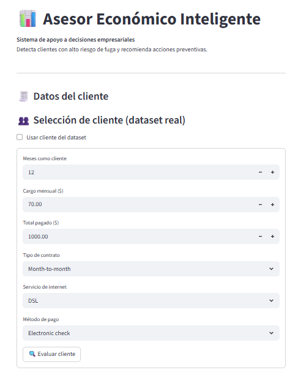
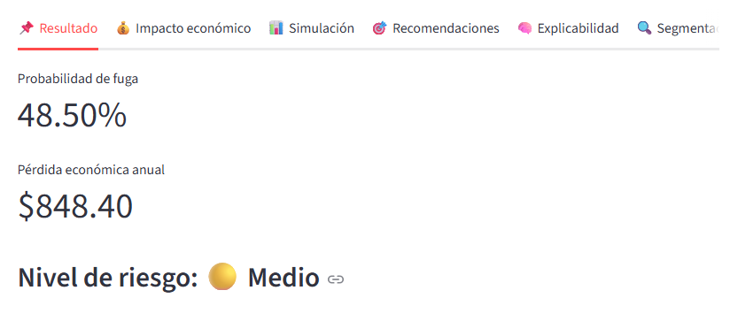
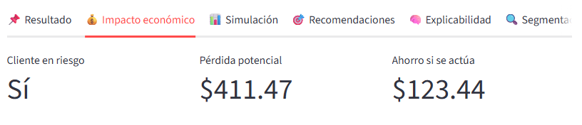

# 📊 Asesor Económico Inteligente

## 🚀 Descripción del proyecto

**Asesor Económico Inteligente** es una aplicación desarrollada con **Streamlit** y **Machine Learning** que apoya la **toma de decisiones empresariales**, permitiendo identificar clientes con **alto riesgo de fuga (churn)** y estimar el **impacto económico anual** asociado a dicha pérdida.

El sistema no solo predice el riesgo, sino que también:
- Explica **por qué** un cliente es riesgoso
- Sugiere **acciones estratégicas** de retención
- Presenta resultados de forma **visual, clara y comprensible** para perfiles no técnicos

Este proyecto fue diseñado con un enfoque práctico para **hackathons, análisis empresarial y apoyo a áreas comerciales y financieras**.

---

## 🎯 Objetivo

Ayudar a las empresas a **anticiparse a la pérdida de clientes**, priorizar acciones de retención y **minimizar pérdidas económicas**, utilizando analítica predictiva e interfaces intuitivas.

---

## 🧠 ¿Cómo funciona?

1. El usuario ingresa los **datos clave del cliente** (antigüedad, cargos, contrato, servicios, método de pago).
2. El modelo de Machine Learning calcula la **probabilidad de fuga**.
3. El sistema clasifica el riesgo en tres niveles:
   - 🔴 Alto
   - 🟡 Medio
   - 🟢 Bajo
4. Se estima el **impacto económico anual**.
5. Se muestran **recomendaciones accionables**.
6. Un **chat explicativo inteligente** permite entender las razones del riesgo.

---

## 🧩 Tecnologías utilizadas

- **Python 3.11**
- **Streamlit** – Interfaz web interactiva
- **Pandas** – Manipulación de datos
- **Scikit-learn** – Modelo de Machine Learning (Random Forest)
- **Joblib** – Persistencia del modelo

---

## 📂 Estructura del proyecto

```
📁 Asesor-Economico-Inteligente
│
├── app.py              # Aplicación principal Streamlit
├── model.pkl           # Modelo entrenado de Machine Learning
├── features.pkl        # Lista de variables usadas por el modelo
├── README.md           # Documentación del proyecto
└── requirements.txt    # Dependencias del proyecto
```

---

## ⚙️ Instalación y ejecución

### 1️⃣ Clonar el repositorio

```bash
git clone <URL_DEL_REPOSITORIO>
cd Asesor-Economico-Inteligente
```

### 2️⃣ Crear entorno virtual (opcional pero recomendado)

```bash
python -m venv venv
venv\Scripts\activate
```

### 3️⃣ Instalar dependencias

```bash
pip install -r requirements.txt
```

### 4️⃣ Ejecutar la aplicación

```bash
python -m streamlit run app.py
```

Luego abre en tu navegador:
```
http://localhost:8501
```

---

## 📈 Resultados que muestra la app

- ✅ Probabilidad de fuga (%)
- 💸 Pérdida económica anual estimada
- 🚦 Nivel de riesgo visual
- 💡 Recomendaciones estratégicas

---

## 🧪 Casos de uso

- Áreas de **retención de clientes**
- Departamentos de **finanzas y planeación**
- **Análisis estratégico** de cartera de clientes
- Demostraciones en **hackathons y proyectos académicos**

---

## 🖼️ Capturas de funcionalidad

### 📋 Formulario de ingreso de datos


### 📊 Resultado del análisis y riesgo


### 💬 Impacto Economico



---

## 🌟 Valor agregado

✔ Enfoque empresarial claro
✔ Impacto económico cuantificado
✔ Explicabilidad del modelo
✔ Interfaz intuitiva
✔ Aplicación lista para uso real

Este proyecto no solo predice, **ayuda a decidir**.

---

## 👤 Autor

Proyecto desarrollado por:
**[Dario Alejandro Tul Teo]** 
**[José Javier Bonilla Salazar]**
**[Josué Daniel Fuentes Díaz]**
**[Sergio Andrés Larios Fajardo]**
**[Yeshua David Inay Ramos]**
Hackathon AI SIC

---

> *"Aquí la empresa decide antes de perder ingresos."* 💡
